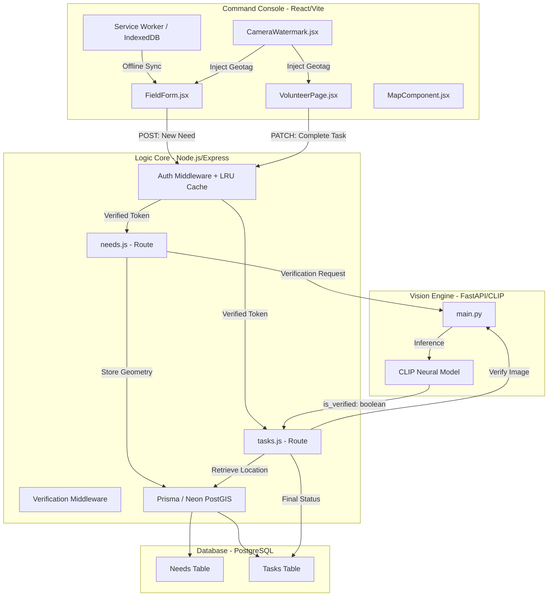

# 🌉 SevaSetu: AI-Powered Disaster Intelligence & Response System

> **The Problem:** In disaster management, "Information Chaos" is the biggest enemy. Fake reports, location spoofing, unverified work, and connectivity dropouts lead to wasted resources and lost lives.
> **The Solution:** SevaSetu—A platform that combines Geo-Spatial Mathematics, Computer Vision, Real-Time Orchestration, and Offline-First PWAs to create an unbreakable "Trust Layer" for relief operations.

---

## 🔄 The Complete SevaSetu Workflow

SevaSetu operates on a highly structured, role-based pipeline designed to process disaster intelligence from the ground up to final resolution.

### **Phase 1: Intelligence Intake (The User / Field Worker)**
1. **Report Submission:** A local civilian (User) or a designated Field Worker logs into the system and navigates to the **Field Terminal** (`/field`).
2. **Offline-First Capture:** Even if the network is down (e.g., cell towers destroyed), the user can fill out the form. The system securely caches the submission in an **IndexedDB Offline Queue**.
3. **Geo-Locked Media:** The user takes a live photo using the custom in-browser camera. The app injects mathematically verifiable GPS coordinates into the image's EXIF data.
4. **Synchronization:** The moment an internet connection is restored, the Service Worker automatically flushes the queue and pushes the report to the central server.

### **Phase 2: Triage & Orchestration (The Coordinator)**
1. **Real-Time Dashboard:** The Coordinator sits at the **Command Center** (`/dashboard`). Thanks to high-frequency, non-blocking **Auto-Polling** (every 5 seconds), new distress signals appear instantly without needing a manual refresh.
2. **Urgency Assessment:** Reports are auto-scored by the algorithm: `Urgency = (CategoryWeight * 10) + (TimeElapsed * 1.5)`.
3. **Volunteer Approval:** The Coordinator monitors the **Volunteer Approvals** pipeline. Regular users who apply to help are screened and promoted to the `volunteer` role in a single click.
4. **Dispatch:** The Coordinator assigns verified tasks to available, geolocated volunteers based on proximity and skill set.

### **Phase 3: Execution & AI Verification (The Volunteer)**
1. **Mission Briefing:** The Volunteer receives the task on their dedicated **Volunteer Dash** (`/volunteer`).
2. **Execution & Proof:** Upon reaching the site and delivering aid, the volunteer must submit "Proof of Work" via the secure camera.
3. **Multi-Engine AI Verification:**
   - **Spatial Check:** PostGIS verifies the volunteer is actually within the target radius using `ST_Distance`.
   - **Temporal Check:** EXIF metadata is parsed to ensure the photo is live, not a gallery upload.
   - **Semantic Check (Vision AI):** The image is sent to the FastAPI service where an **OpenAI CLIP Neural Model** mathematically compares the image contents (e.g., "flood relief package") against the expected task category.
4. **Closure:** If the AI scores the proof above the confidence threshold, the task is marked `Completed` and archived.

---

## 🏛️ System Architecture & Connectivity Map

---

## 🛠️ The Technical Inventory: A Component-Level Deep Dive

### **1. Frontend: The High-Integrity Client**
- **React 19 & Vite:** Optimized with strict lazy-loading boundaries to prevent context duplication (`resolveDispatcher` errors) during aggressive chunking.
- **Progressive Web App (PWA):** Implements a Service Worker (`sw.js`) and IndexedDB for full offline functionality.
- **Piexifjs & Exifr:** Manipulates and reads the `APP1` segment of a JPEG file to inject and verify GPS data locally.
- **Leaflet.js:** Uses custom markers and Geo-Spatial overlays to render disaster sites in real-time.

### **2. Backend: The Geo-Spatial Brain**
- **Node.js & Express:** The core REST API server.
- **Prisma ORM & Neon Serverless Postgres:**
    - Uses a custom `Unsupported("geometry(Point, 4326)")` field to support native PostGIS geometries.
    - **LRU Auth Cache Optimization:** To support 5-10 second auto-polling across thousands of dashboards without hitting Neon's connection pool limits, a 15-second in-memory LRU cache intercepts Clerk JWTs and caches the DB identity, reducing DB load by 90%.
- **PostGIS (The Geometry Engine):** Uses `ST_SetSRID` and `ST_Distance` to mathematically calculate distances over the Earth's curvature.
- **Clerk Backend SDK:** Handles authentication and identity management, gating endpoints behind strict `user`, `volunteer`, and `coordinator` roles.

### **3. AI Service: The Semantic Validator**
- **FastAPI:** A Python ASGI framework built for high-concurrency asynchronous tasks.
- **OpenAI CLIP (Neural Model):** A "Multi-Modal" model that maps images and text into the same vector space, calculating Cosine Similarity between the uploaded proof and the expected disaster label.
- **PyTorch & PIL:** Handles GPU execution and advanced image pre-processing (resizing, normalization).

---

## 🧪 Detailed Tech Stack Summary

| Tool | Category | Specific Role |
| :--- | :--- | :--- |
| **React/Vite** | Frontend | Highly responsive, component-driven UI with lazy loading. |
| **IndexedDB/SW** | PWA Offline | Queues disaster reports when cell towers are destroyed. |
| **Piexifjs / Exifr** | Binary Utility | Writing & Reading GPS data directly into/from JPEG binary. |
| **PostGIS** | GIS Extension | Mathematical Earth-surface distance & proximity calculations. |
| **Prisma** | ORM | Database schema management & Typed queries. |
| **Neon** | Serverless DB | Auto-scaling PostgreSQL hosting. |
| **CLIP** | Neural Model | Zero-shot image-to-text semantic matching for fraud detection. |
| **FastAPI** | AI Framework | Serving ML models with async performance. |

---

## 🛠️ Technical Challenges Overcome

*   **The Serverless Connection Pool Exhaustion:** High-frequency dashboard auto-polling caused our Neon DB to hit connection limits (17 max). We engineered a lightning-fast 15-second in-memory LRU cache in the authentication middleware that intercepts requests, dropping actual database query volume by over 90% while maintaining real-time UI updates.
*   **Context Loss in Chunking:** Heavy Vite chunking caused React hook crashes (`resolveDispatcher is null`) when mixing static and dynamic imports. We fixed this by standardizing lazy-loading boundaries across all major routing nodes.
*   **The Metadata Preservation Challenge:** Standard browser image processing (Canvas/Img) destroys EXIF data. We treated the image as a raw binary stream and used `piexifjs` to manually rebuild the headers.
*   **Spatial Indexing at Scale:** In a real disaster with 100,000 reports, standard tables lock up. We used **GIST Indexes** on our PostGIS columns to allow for sub-second spatial proximity searches.

---
*SevaSetu: Orchestrating Humanitarian Aid with Mathematical Integrity.*
