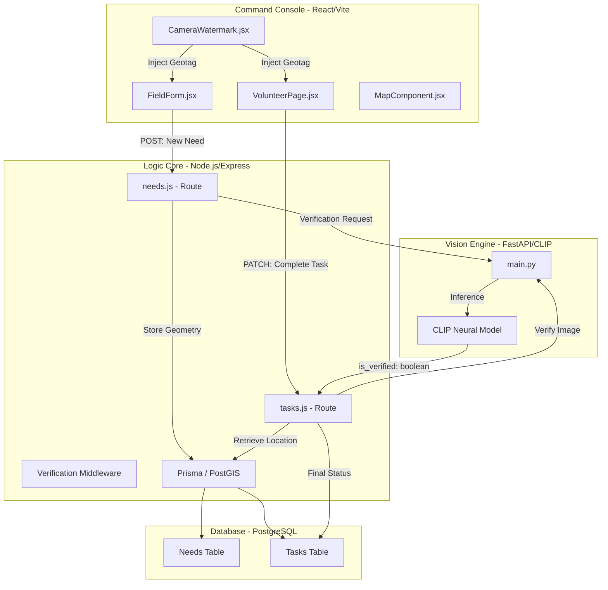

# 🌉 SevaSetu: AI-Powered Disaster Intelligence & Response System

> **The Problem:** In disaster management, "Information Chaos" is the biggest enemy. Fake reports, location spoofing, and unverified work lead to wasted resources and lost lives.
> **The Solution:** SevaSetu—A platform that combines Geo-Spatial Mathematics, Computer Vision, and Real-Time Orchestration to create a "Trust Layer" for relief operations.

---

## 🏛️ System Architecture & Connectivity Map

Below is a technical visual of how the different components of SevaSetu are interconnected. This flow ensures that every piece of data is verified through a multi-engine pipeline.

---

## 🛠️ The Technical Inventory: A Component-Level Deep Dive

This section provides a granular breakdown of every "picky" technical component used in SevaSetu.

### **1. Frontend: The High-Integrity Client**
- **React 19 Hooks:** Heavily utilizes `useRef` for raw DOM access to `<video>` and `<canvas>` elements for the custom camera.
- **Vite (HMR Engine):** Used for Hot Module Replacement, ensuring ultra-fast development and optimized production bundles.
- **Piexifjs (Binary Injector):** 
    - **Usage:** Used to manipulate the `APP1` segment of a JPEG file.
    - **Technicality:** It converts decimal GPS coordinates into the **EXIF Rational** format (Degrees/Minutes/Seconds) and injects them into the `GPSIFD` directory of the image.
- **Exifr (Metadata Parser):** A high-performance metadata reader used on the frontend to provide "Instant Feedback" to volunteers if their photo lacks location data.
- **Leaflet.js (Mapping Engine):** Uses **Custom Marker Icons** and **Geo-Spatial Overlays** to render disaster sites in real-time.
- **Axios (HTTP Client):** Configured with custom `FormData` headers to handle multipart/form-data uploads of high-resolution images.
- **Lucide-React:** Provides optimized SVG icons that are bundled individually to keep the initial load size small.

### **2. Backend: The Geo-Spatial Brain**
- **Node.js & Express:** The core REST API server.
- **Prisma ORM (Schema-as-Code):**
    - **Technicality:** Uses a custom `Unsupported("geometry(Point, 4326)")` field in the schema to support native PostGIS geometries.
- **PostGIS (The Geometry Engine):**
    - **Functions Used:** 
        - `ST_SetSRID(ST_MakePoint(lng, lat), 4326)`: To convert raw numbers into earth-projected points.
        - `ST_Distance(geom1, geom2)`: Used to calculate the "Great Circle" distance between a reporter and a volunteer.
- **Multer (Memory Engine):** Handles file uploads. We use **Memory Storage** (Buffers) instead of Disk Storage to allow for instant, sub-millisecond passing of images to the AI service.
- **Tesseract.js (The Fallback OCR):** An on-device OCR engine used to scan images for text-based coordinate watermarks if the primary EXIF verification fails.
- **Clerk Backend SDK:** Handles JWT (JSON Web Token) verification to ensure that only authorized volunteers can claim and complete missions.

### **3. AI Service: The Semantic Validator**
- **FastAPI:** A Python ASGI framework built for high-concurrency asynchronous tasks.
- **OpenAI CLIP (Neural Model):**
    - **Architecture:** A "Multi-Modal" model that maps images and text into the same vector space.
    - **Logic:** It calculates the **Cosine Similarity** between the image and a set of "Emergency Labels" (e.g., "a photo of a flood").
- **PyTorch:** The underlying deep learning library used to run the CLIP model on the GPU.
- **PIL (Pillow):** Used for advanced image pre-processing (resizing, normalization) before the image is fed into the Neural Network.
- **Python-Multipart:** Essential for parsing the binary image streams sent from the Node.js backend.

---

## 🚀 Full Feature Catalog (A-Z)

### **A. Intelligence Intake (Victim Reporting)**
*   **Urgency Scoring Algorithm:** A weighted priority system: `Urgency = (CategoryWeight * 10) + (TimeElapsed * 1.5)`.
*   **Autonomous Geolocation:** Uses the `navigator.geolocation` API with `enableHighAccuracy: true`.

### **B. Volunteer Mission Console**
*   **Proximity Filter:** Uses a PostGIS `ST_DWithin` query to only show tasks within a volunteer's operational radius.
*   **State Machine:** Managed through Prisma transitions to prevent "Double Claiming" of the same mission.

### **C. The Trust Layer (Security)**
*   **Anti-Spoofing Camera:** A full-screen `<video>` implementation that locks out the gallery to prevent the use of fake photos.
*   **Multi-Engine Verification:** 
    1. **Spatial:** Proximity check via PostGIS.
    2. **Temporal:** Timestamp check via EXIF.
    3. **Semantic:** Content check via CLIP AI.

---

## 🧪 Detailed Tech Stack Summary

| Tool | Category | Specific Role |
| :--- | :--- | :--- |
| **Vite** | Build Tool | Production bundling & Dev server. |
| **Piexifjs** | Binary Utility | Writing GPS data into JPEG binary segments. |
| **Exifr** | Parser | Reading GPS data from binary images. |
| **PostGIS** | GIS Extension | Mathematical Earth-surface calculations. |
| **Prisma** | ORM | Database schema management & Typed queries. |
| **CLIP** | Neural Model | Zero-shot image-to-text semantic matching. |
| **Tesseract.js**| OCR | Extraction of text from images (Fallback). |
| **FastAPI** | AI Web Framework| Serving ML models with async performance. |

---

## 🛠️ Technical Challenges Overcome

*   **The Metadata Preservation Challenge:** Standard browser image processing (Canvas/Img) destroys EXIF data. We solved this by treating the image as a binary stream and using `piexifjs` to manually rebuild the headers.
*   **The Cold Start AI Problem:** Large ML models take time to load. We implemented a "Health Check" system and used pre-warmed instances to ensure instantaneous verification.
*   **Spatial Indexing:** In a real disaster with 100,000 reports, a normal database would crash. We used **GIST Indexes** on our PostGIS columns to allow for sub-second spatial searches.

---
*SevaSetu: Orchestrating Humanitarian Aid with Mathematical Integrity.*
