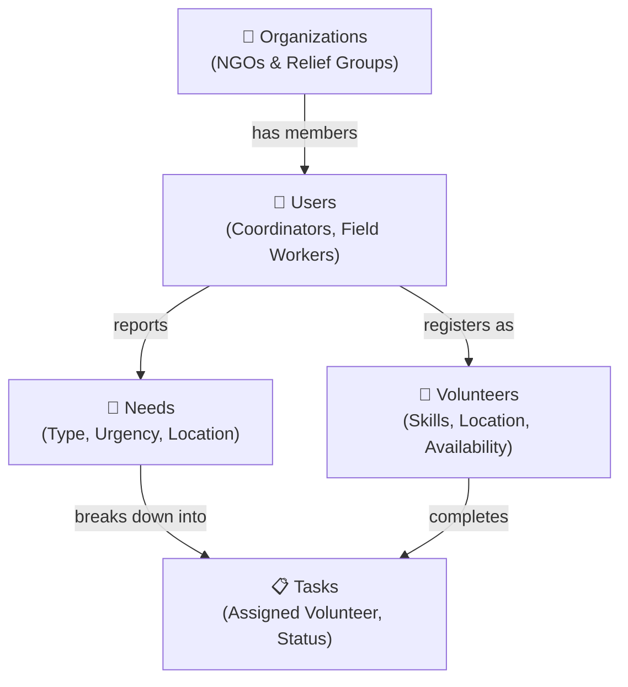

# 🗄️ SevaSetu — Entity Relationship Diagram

## Visual Schema

## Spatial Indexes

| Table | Column | Index Type | Purpose |
|---|---|---|---|
| `volunteers` | `location` | GIST | Fast geo-proximity queries for volunteer matching |
| `needs` | `location` | GIST | Heatmap rendering and distance calculations |

## Key Relationships

- **Users → Organizations**: Many-to-one (optional). A user belongs to one org.
- **Users → Volunteers**: One-to-one extension. Only users with `role = 'volunteer'` get a volunteers row.
- **Users → Needs**: One-to-many. Field workers / coordinators report needs.
- **Needs → Tasks**: One-to-many. A need can have multiple task assignments over time.
- **Users → Tasks**: One-to-many. A volunteer can be assigned to multiple tasks.

## PostGIS Usage

All location columns use **SRID 4326** (WGS 84 — standard GPS coordinates).

Key spatial functions used:
- `ST_SetSRID(ST_MakePoint(lng, lat), 4326)` — create a point from coordinates
- `ST_Distance(a::geography, b::geography)` — distance in meters between two points
- GIST indexes enable fast nearest-neighbor queries for volunteer matching
